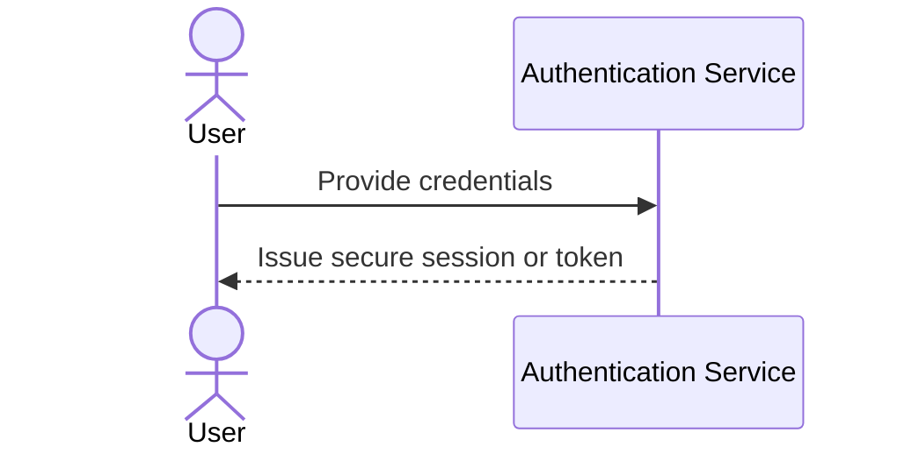
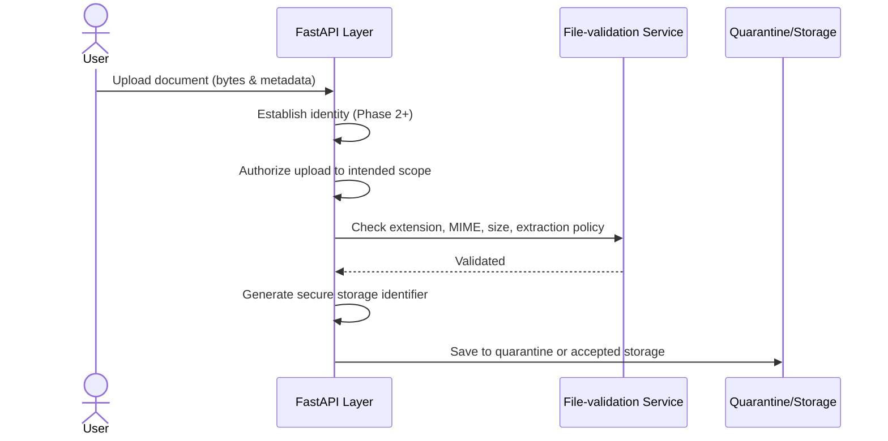
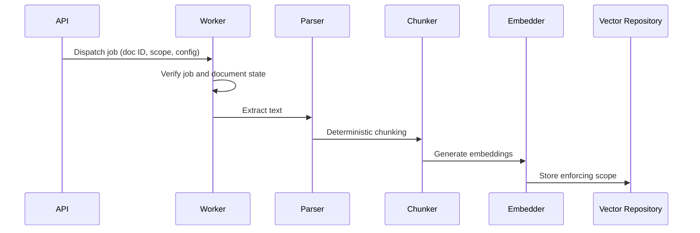
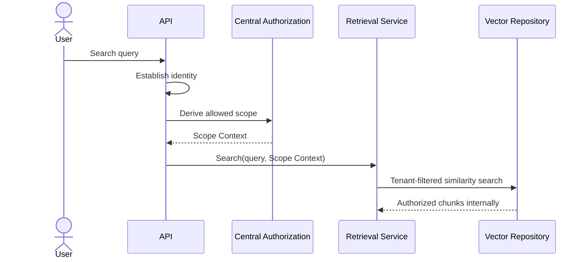
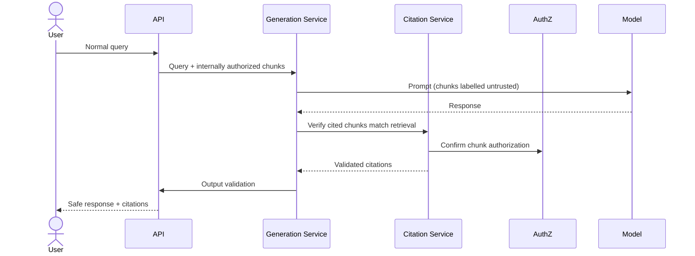
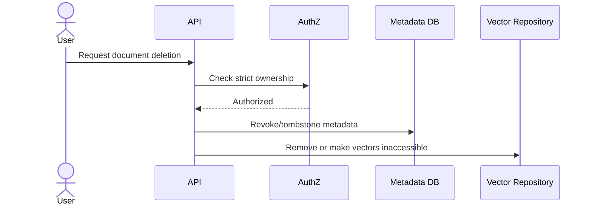
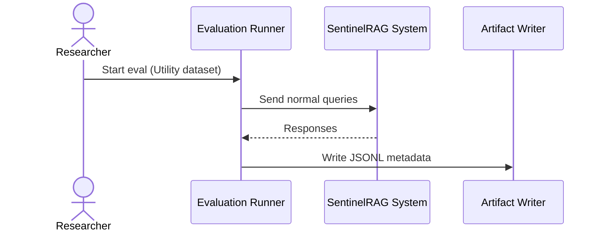
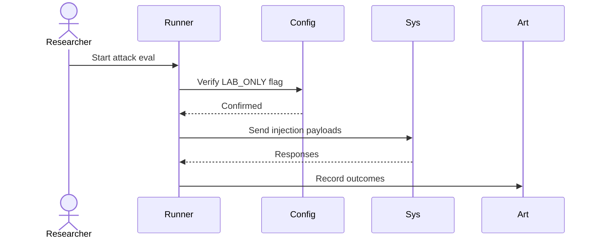
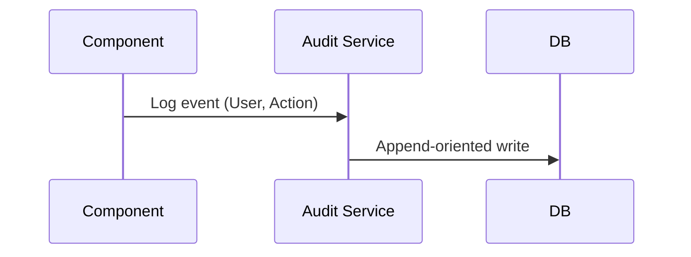
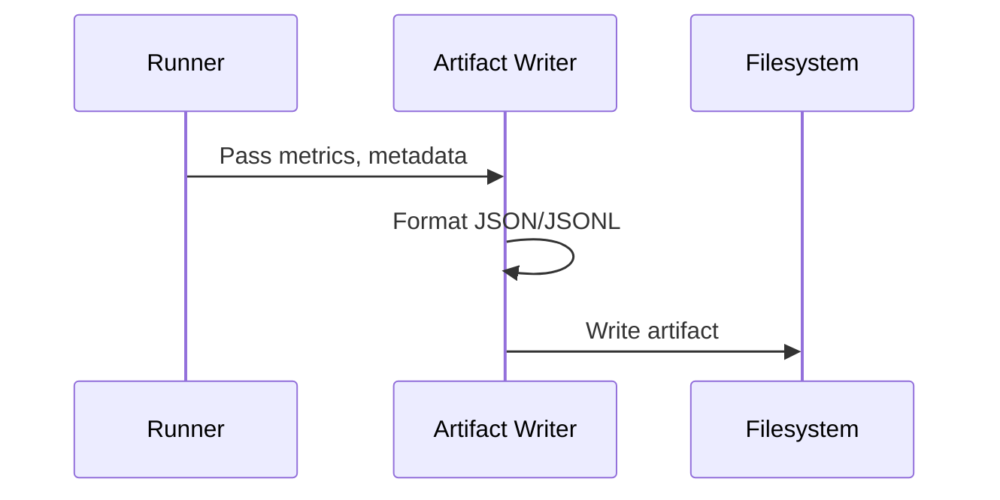

# Architecture

## Current Implemented State (Phase 0)
The current implemented state is purely a repository foundation.
- Python package baseline
- Tooling and dependency lock configuration
- Governance documents

## Planned Components

### Phase 1 — Core Local RAG Baseline (PLANNED)
* **FastAPI API layer:** Base API endpoints.
* **Streamlit basic research dashboard:** Initial interface for local execution.
* **Model-provider abstraction (IMPLEMENTED in Phase 1B):** Interfaces with various underlying LLMs via a central `Provider` protocol.
* **Ollama adapter (IMPLEMENTED in Phase 1B):** Local integration for Ollama models enforcing strict loopback-only constraints.
* **LM Studio adapter (IMPLEMENTED in Phase 1B):** OpenAI-compatible local integration enforcing strict loopback-only constraints.
* **Embedding service:** Interfaces with the selected embedding models.
* **Parser abstraction:** Standardized interfaces for extracting text from different formats.
* **Baseline-safe file-validation service:** Enforces baseline safety (allowlisted extensions, MIME validation, maximum file size, safe generated storage names, no user-supplied filesystem paths, content hashing, parser and extraction limits, transactional failure).
* **Baseline quarantine or rejection state:** Rejects invalid files prior to parsing.
* **Deterministic chunking:** Consistently divides text for embeddings.
* **Relational metadata repository:** Basic metadata tracking.
* **Vector repository:** Stores embeddings and index configurations.
* **Retrieval service:** Core logic to query the vector repository.
* **Citation service:** Links generated text to source chunks.
* **Generation service:** Core logic to prompt the model with context.
* **Prompt-template registry:** Version-controlled storage of system and user prompts.
* **Configuration service:** Manages parameters and feature flags.
* **Database-session management:** Scoped session connection handling sufficient for the baseline.

### Phase 2 — Identity, Isolation, and Secure-Ingestion Expansion (PLANNED)
* **Authentication service:** Handles user identity and passwords.
* **Central authorization policy:** Enforces RBAC/ABAC on all data access and document ownership.
* **Tenant-scoped retrieval:** Filters vector similarity searches to the authorized tenant.
* **Citation authorization:** Ensures cited chunks map to the authorized retrieval set.
* **Revocation and deletion enforcement:** Safely tombstone and remove data.
* **Secure-ingestion hardening:** Expands validation beyond the Phase 1 baseline with path-traversal tests, stronger MIME/extension spoofing tests, oversized-input negative tests, and cross-user negative tests.
* **Per-user controls:** Finer-grained boundaries.
* **Security audit events:** Append-oriented, access-controlled, and tamper-evident logging of security-critical actions.

### Phases 3–6 — Research and Evaluation (PLANNED)
* **Evaluation runner:** Orchestrates tests against the system.
* **Dataset and attack-case registry:** Stores standardized prompts for measuring defense utility.
* **Experiment-artifact writer:** Outputs reproducible JSON/JSONL metrics and run conditions.
* **Comparative experiment support:** Measures security, utility, and latency tradeoffs.
* **Automated red-team adapters:** Interfaces for automated attack suites where justified.
* **Advanced dashboard comparison and reporting:** Expands the basic Phase 1 interface into a full research dashboard.

### Deferred Phase 7 — Deployment Hardening (DEFERRED)
* Containerization, SBOM generation, container scanning, and runtime privilege reduction are deferred until a runnable service exists.
* Deployment hardening.
* Kubernetes remains a non-goal unless a future measured requirement explicitly changes that decision.

## Required Security-Critical Placement Invariants
* User identity is established before authorized operations.
* Authorization is server-side.
* Authorization is centralized.
* Tenant filtering occurs within or before retrieval.
* Unauthorized chunks are never sent to the model.
* Citation access uses the same authorization policy.
* Revoked or deleted documents cannot be retrieved.
* User-supplied file paths are never trusted directly.
* Uploaded content and retrieved context are untrusted.
* Model output is untrusted.
* No model-generated code is executed.
* Model providers cannot bypass application authorization.
* Local model service failure must fail safely.
* Prompt templates are versioned.
* Embedding configurations are versioned.
* Index/query embedding mismatches fail clearly.
* Evaluation artifacts record provenance.
* No external paid provider is enabled by default.
* Controlled reduced-defence mode is disabled by default and isolated.

## Required Data Flows

### 1. Authentication

* **Actor:** User
* **Trust-boundary crossings:** API boundary (external to internal)
* **Authorization decision:** N/A (Authentication step)
* **Stored data:** Server-side session identifier or short-lived signed token
* **Failure behaviour:** Request denied (401)
* **Provenance recorded:** Audit event of login success/failure

### 2. Document Upload and Validation

* **Actor:** User
* **Trust-boundary crossings:** API boundary, Filesystem boundary
* **Authorization decision:** Explicit authorization into the intended user or tenant scope.
* **Stored data:** Raw file with secure generated identifier (no user paths).
* **Failure behaviour:** Rejected content is not parsed and enters quarantine or deletion.
* **Provenance recorded:** Audit and provenance metadata recorded.

### 3. Parsing, Chunking and Embedding

* **Actor:** System (Background worker)
* **Trust-boundary crossings:** Model provider boundary (Embedding service)
* **Authorization decision:** The ingestion job is created only after upload authorization and validation. The job carries an immutable internal document ID, owner or tenant scope, and configuration version. Every write strictly uses the same owner or tenant scope.
* **Stored data:** Vectors, metadata
* **Failure behaviour:** A missing, revoked, rejected, or mismatched scope causes fail-closed termination.
* **Provenance recorded:** Parser version, chunking configuration, embedding model, digest, and document identity.

### 4. Authorized Retrieval

* **Actor:** User
* **Trust-boundary crossings:** Database boundary
* **Authorization decision:** Enforce centralized tenant filtering on vector search before chunks are returned.
* **Stored data:** None
* **Failure behaviour:** Returns 0 results or fails safely.
* **Provenance recorded:** Query parameters logged.

### 5. Generation and Citation Validation

* **Actor:** User
* **Trust-boundary crossings:** Model provider boundary
* **Authorization decision:** Central authorization guarantees the generation service only receives retrieved chunks already vetted for access. The user never supplies trusted chunks.
* **Stored data:** None
* **Failure behaviour:** Output validation fails safely before the response reaches the user.
* **Provenance recorded:** Model provider, version, parameters.

### 6. Document Deletion or Revocation

* **Actor:** User
* **Trust-boundary crossings:** Database boundary
* **Authorization decision:** Strict ownership check is performed first.
* **Stored data:** Tombstone records and physical removal.
* **Failure behaviour:** Partial failure leaves the document non-retrievable (vectors inaccessible). A revoked document cannot reappear in retrieval while physical cleanup is pending.
* **Provenance recorded:** Retry and reconciliation evidence is recorded alongside the audit event of deletion.

### 7. Normal Evaluation Run

* **Actor:** Researcher
* **Trust-boundary crossings:** Internal harness boundary
* **Authorization decision:** Researcher privileges.
* **Stored data:** Evaluation metrics.
* **Failure behaviour:** Evaluation halted, error logged.
* **Provenance recorded:** Git commit, config hash.

### 8. Controlled Attack Evaluation

* **Actor:** Researcher
* **Trust-boundary crossings:** Internal harness boundary
* **Authorization decision:** Requires LAB_ONLY explicit flag.
* **Stored data:** Attack outcomes.
* **Failure behaviour:** Fail safely if LAB_ONLY missing.
* **Provenance recorded:** Dataset manifest digest.

### 9. Audit-Event Recording

* **Actor:** System components
* **Trust-boundary crossings:** Database boundary
* **Authorization decision:** System level.
* **Stored data:** Append-oriented, access-controlled, tamper-evident audit trails.
* **Failure behaviour:** Security-critical logging failure requires fail-closed handling. Non-critical telemetry failure is isolated without silently dropping security events.
* **Provenance recorded:** Timestamp, actor, action.

### 10. Experiment-Artifact Generation

* **Actor:** Evaluation runner
* **Trust-boundary crossings:** Filesystem boundary
* **Authorization decision:** Harness level.
* **Stored data:** Experiment JSON/JSONL.
* **Failure behaviour:** Output error.
* **Provenance recorded:** Random seed, hardware summary, full configuration.

## Deployment Model
* **Local modular monolith:** Single deployment unit encapsulating all logic to simplify execution.
* **Separate local model process:** Model inference runs in a distinct process (e.g. Ollama).
* **PostgreSQL/pgvector planned:** Standardized relational and vector storage backend.
* **Streamlit interface:** Provided strictly as a research interface, not as proof of production frontend security.
* **Containers deferred:** Containerization is deferred to Phase 7 until a runnable service exists natively.
* **CPU fallback intent:** Capable of running gracefully on CPU if GPU is absent.
* **Hardware constraints:** Designed to run within RTX 4060 8 GB VRAM limitations.
* **No cloud service requirement:** True local-first architecture ensuring no mandatory external dependencies.
