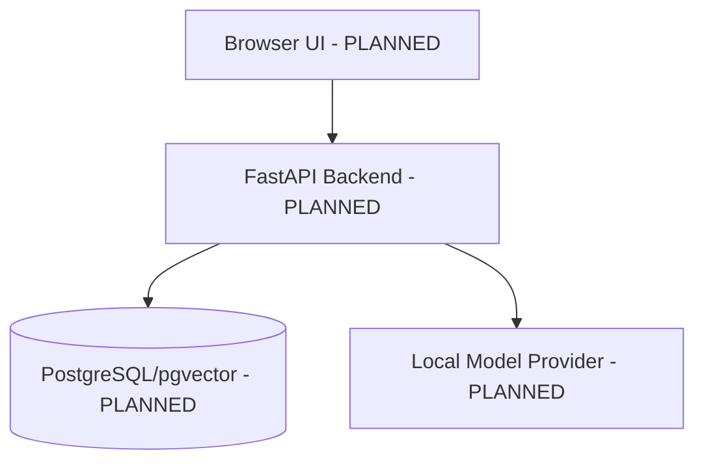
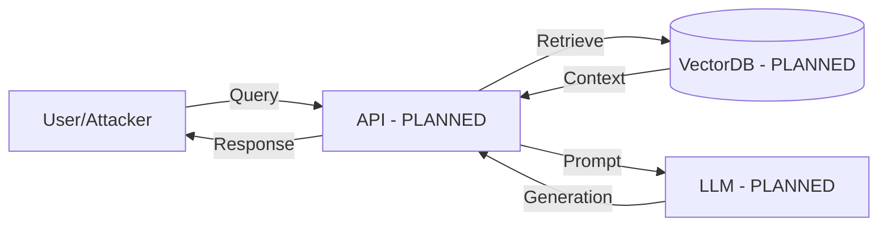

# Architecture

## Current Implemented Architecture
Currently, the architecture consists of a minimal Python package and development tooling only.

## Planned Local-First Modular Monolith
In future phases, the system will use a local-first modular monolith architecture.
* **Backend:** FastAPI (Planned)
* **Frontend:** Streamlit research dashboard (Planned)
* **Database:** PostgreSQL plus pgvector (Planned)
* **Models:** Local model providers (Planned)
* **Modules:** Ingestion, retrieval, generation, evaluation, and observability modules (Planned)

## Trust Boundaries
The following trust boundaries are planned:
* Browser
* Backend API
* Database
* Model Service
* Host Filesystem
* CI and GitHub

## Component Diagram

## Data Flow Diagram

## Security Invariants
* Local-first design
* No secrets or credentials
* No paid API or service dependency

## Deployment Intent
The project is intended to be run locally for research purposes using Docker/Docker Compose (Planned) or local virtual environments.
